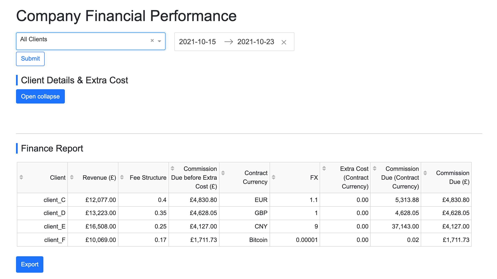

## auto_report_using_dash_python



## Demo Site

Click [here](https://dash-demo-293b499aacc7.herokuapp.com/)

- user name: test
- password: test

## Prject Description 

Create report template using Dash, Python for Finance team to download financial reports directly.

## How to run the app

#### 1. Clone this repository and open a terminal inside the root folder.

#### 2. Install the requirements *(to be done in virtual environment)*:

```bash
pip install -r requirements.txt
```
#### 3. Run the app:

```bash
python app.py
```
#### 4. Open a browser at http://127.0.0.1:8050


### Credit

- [Bootstrap](https://github.com/tcbegley/dash-bootstrap-css)
- [Dash Official Github - dash-sample-apps](https://github.com/plotly/dash-sample-apps)
